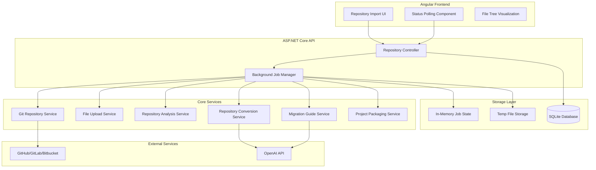

# Design Document

## Overview

The Repository Resurrection feature extends StackOverGrave to handle full repository imports from Git URLs or ZIP uploads. The system analyzes repositories, enforces size limits, intelligently prioritizes files, performs batch AI conversions, and packages results with migration guides. The architecture follows the existing ASP.NET Core Web API backend with Angular frontend pattern, adding new services for Git operations, repository analysis, batch processing, and background job management.

## Architecture

### High-Level Architecture



### Technology Stack

- **Backend**: ASP.NET Core 8 Web API
- **Frontend**: Angular 17 with standalone components
- **Database**: SQLite (existing AppDbContext)
- **AI**: OpenAI GPT-3.5-turbo (existing AiConversionService)
- **Storage**: File system for temporary files, in-memory Dictionary for job state
- **HTTP**: HttpClient for Git repository downloads


## Components and Interfaces

### Backend Components

#### 1. RepositoryController

**Responsibility**: HTTP endpoint handling for repository operations

**Endpoints**:
- `POST /api/repository/import` - Import from Git URL
- `POST /api/repository/upload` - Upload ZIP file
- `GET /api/repository/status/{id}` - Poll conversion status
- `GET /api/repository/download/{id}` - Download converted package

**Dependencies**: IRepositoryJobProcessor, IFileStorageService, AppDbContext

```csharp
public class RepositoryController : ControllerBase
{
    private readonly IRepositoryJobProcessor _jobProcessor;
    private readonly IFileStorageService _fileStorage;
    private readonly AppDbContext _context;
    
    [HttpPost("import")]
    public async Task<IActionResult> ImportFromGit([FromBody] GitImportRequest request);
    
    [HttpPost("upload")]
    public async Task<IActionResult> UploadZip(IFormFile file);
    
    [HttpGet("status/{id}")]
    public IActionResult GetStatus(Guid id);
    
    [HttpGet("download/{id}")]
    public async Task<IActionResult> DownloadPackage(Guid id);
}
```

#### 2. GitRepositoryService

**Responsibility**: Download repositories from Git hosting platforms

**Key Methods**:
- `DownloadRepositoryAsync(string url)` - Convert URL and download ZIP
- `TryBranchesAsync(string baseUrl, string[] branches)` - Try multiple branch names
- `ConvertToZipUrl(string repoUrl)` - Convert repo URL to archive URL

**URL Conversion Logic**:
- GitHub: `https://github.com/user/repo` → `https://github.com/user/repo/archive/refs/heads/{branch}.zip`
- GitLab: `https://gitlab.com/user/repo` → `https://gitlab.com/user/repo/-/archive/{branch}/repo-{branch}.zip`
- Bitbucket: `https://bitbucket.org/user/repo` → `https://bitbucket.org/user/repo/get/{branch}.zip`

```csharp
public interface IGitRepositoryService
{
    Task<byte[]> DownloadRepositoryAsync(string url, CancellationToken cancellationToken = default);
}
```

#### 3. RepositoryAnalysisService

**Responsibility**: Scan, analyze, and prioritize repository files

**Key Methods**:
- `AnalyzeRepositoryAsync(string extractPath)` - Full repository analysis
- `ScoreFile(string filePath, string content)` - Calculate criticality score
- `DetectTechnology(IEnumerable<string> files)` - Identify legacy tech
- `ValidateLimits(AnalysisResult result)` - Enforce size constraints

**File Scoring Algorithm**:
```csharp
int CalculateCriticalityScore(string filePath, string content)
{
    int score = 0;
    
    // Entry points
    if (content.Contains("Sub Main") || content.Contains("static void Main"))
        score += 100;
    
    // Directory-based scoring
    if (filePath.Contains("/Models/") || filePath.Contains("/Entities/"))
        score += 80;
    else if (filePath.Contains("/Services/") || filePath.Contains("/Business/"))
        score += 60;
    else if (filePath.Contains("/Controllers/") || filePath.Contains("/Forms/"))
        score += 40;
    
    // Size-based scoring
    int lineCount = content.Split('\n').Length;
    if (lineCount < 100)
        score += 20;
    else if (lineCount > 1000)
        score -= 1000;
    
    return score;
}
```

**Analysis Result Model**:
```csharp
public class RepositoryAnalysisResult
{
    public int TotalFiles { get; set; }
    public int TotalLinesOfCode { get; set; }
    public TechnologyType DetectedTechnology { get; set; }
    public ProjectSize ProjectSize { get; set; } // Small, Medium, TooLarge
    public List<FileInfo> PrioritizedFiles { get; set; }
    public List<string> ValidationErrors { get; set; }
}

public class FileInfo
{
    public string RelativePath { get; set; }
    public int LineCount { get; set; }
    public int CriticalityScore { get; set; }
    public bool SelectedForConversion { get; set; }
}
```


#### 4. RepositoryConversionService

**Responsibility**: Orchestrate batch file conversion with context management

**Key Methods**:
- `ConvertRepositoryAsync(AnalysisResult analysis, string extractPath)` - Convert all selected files
- `BuildContextualPrompt(FileInfo file, List<ConvertedFile> previousFiles)` - Create AI prompt with context
- `ConvertFileAsync(FileInfo file, string context)` - Convert single file

**Context Management Strategy**:
- Maintain a running context of previously converted files
- Include relevant imports, models, and interfaces in subsequent prompts
- Limit context size to stay within token limits (max 2000 tokens per request)
- Prioritize recent and related files in context

```csharp
public interface IRepositoryConversionService
{
    Task<RepositoryConversionResult> ConvertRepositoryAsync(
        RepositoryAnalysisResult analysis,
        string extractPath,
        IProgress<ConversionProgress> progress,
        CancellationToken cancellationToken = default);
}

public class RepositoryConversionResult
{
    public List<ConvertedFile> ConvertedFiles { get; set; }
    public List<FileConversionError> Errors { get; set; }
    public int TotalTokensUsed { get; set; }
    public decimal EstimatedCost { get; set; }
}

public class ConvertedFile
{
    public string OriginalPath { get; set; }
    public string ConvertedPath { get; set; }
    public string OriginalCode { get; set; }
    public string ConvertedCode { get; set; }
    public List<string> Dependencies { get; set; }
}
```

**Conversion Order**:
1. Models and data structures (highest priority)
2. Service/business logic layer
3. UI components and controllers
4. Utility and helper files

#### 5. MigrationGuideService

**Responsibility**: Generate comprehensive migration documentation for medium projects

**Key Methods**:
- `GenerateMigrationGuideAsync(RepositoryConversionResult result, AnalysisResult analysis)` - Create guide
- `BuildGuidePrompt(ConversionResult result)` - Create AI prompt for guide generation

**Guide Structure**:
```markdown
# Migration Guide

## Project Summary
- Original Technology: [VB6/Flash/Silverlight]
- Target Technology: [.NET 8/TypeScript/Angular]
- Files Converted: 15 of 40
- Estimated Completion Time: 8-16 hours

## Converted Files
1. Models/User.vb → Models/User.cs
2. Services/AuthService.vb → Services/AuthService.cs
...

## Find and Replace Patterns
- `Dim x As String` → `string x`
- `Set obj = New Class` → `var obj = new Class()`
...

## File-by-File Notes
### Models/User.cs
- Converted VB6 Collection to List<T>
- Added nullable reference types
- Replaced On Error with try-catch

## Manual Steps Required
1. Review and convert remaining 25 files
2. Update database connection strings
3. Test authentication flow
4. Migrate configuration files
...

## Dependencies to Install
- Microsoft.EntityFrameworkCore (8.0.0)
- Serilog.AspNetCore (8.0.0)
...

## Breaking Changes
- Session state management changed
- File I/O now async
...

## Warnings
- Legacy COM components need replacement
- Database schema may need updates
...
```

```csharp
public interface IMigrationGuideService
{
    Task<string> GenerateMigrationGuideAsync(
        RepositoryConversionResult conversionResult,
        RepositoryAnalysisResult analysisResult,
        CancellationToken cancellationToken = default);
}
```


#### 6. ProjectPackagingService (Enhanced)

**Responsibility**: Create downloadable ZIP packages with proper structure

**Enhanced Methods**:
- `PackageRepositoryAsync(RepositoryConversionResult result, string projectName)` - Create full package
- `GenerateProjectFile(TechnologyType targetTech, List<string> dependencies)` - Create .csproj or package.json
- `GenerateReadme(RepositoryAnalysisResult analysis)` - Create README.md
- `GenerateGitignore(TechnologyType targetTech)` - Create .gitignore

**Package Structure**:
```
ProjectName-Resurrected/
├── src/
│   ├── Models/
│   │   ├── User.cs
│   │   └── Product.cs
│   ├── Services/
│   │   └── AuthService.cs
│   └── Controllers/
│       └── UserController.cs
├── README.md
├── MIGRATION_GUIDE.md (Medium projects only)
├── .gitignore
└── ProjectName.csproj (or package.json for TypeScript)
```

```csharp
public interface IProjectPackagingService
{
    Task<byte[]> PackageRepositoryAsync(
        RepositoryConversionResult conversionResult,
        RepositoryAnalysisResult analysisResult,
        string migrationGuide = null,
        CancellationToken cancellationToken = default);
}
```

#### 7. RepositoryJobProcessor

**Responsibility**: Manage background conversion jobs with progress tracking

**Key Methods**:
- `StartJobAsync(Guid jobId, JobType type, object parameters)` - Start background job
- `GetJobStatus(Guid jobId)` - Get current job status
- `UpdateProgress(Guid jobId, int percentage, string message)` - Update job progress
- `CleanupJob(Guid jobId)` - Remove temporary files

**Job State Management**:
```csharp
public class RepositoryJob
{
    public Guid Id { get; set; }
    public JobStatus Status { get; set; }
    public int ProgressPercentage { get; set; }
    public string StatusMessage { get; set; }
    public DateTime StartedAt { get; set; }
    public DateTime? CompletedAt { get; set; }
    public string TempDirectory { get; set; }
    public string ResultPackagePath { get; set; }
    public RepositoryAnalysisResult AnalysisResult { get; set; }
    public RepositoryConversionResult ConversionResult { get; set; }
    public List<string> Errors { get; set; }
}

public enum JobStatus
{
    Downloading,    // 0-20%
    Extracting,     // 20-40%
    Analyzing,      // 40-60%
    Converting,     // 60-80%
    Packaging,      // 80-90%
    Completed,      // 100%
    Failed
}
```

**Background Processing Flow**:
```csharp
public async Task ProcessRepositoryJobAsync(Guid jobId, byte[] zipBytes)
{
    try
    {
        UpdateProgress(jobId, 20, "Extracting repository...");
        var extractPath = await ExtractZipAsync(zipBytes, jobId);
        
        UpdateProgress(jobId, 40, "Analyzing repository...");
        var analysis = await _analysisService.AnalyzeRepositoryAsync(extractPath);
        
        if (analysis.ValidationErrors.Any())
        {
            FailJob(jobId, analysis.ValidationErrors);
            return;
        }
        
        UpdateProgress(jobId, 60, "Converting files...");
        var conversionResult = await _conversionService.ConvertRepositoryAsync(
            analysis, 
            extractPath,
            new Progress<ConversionProgress>(p => 
                UpdateProgress(jobId, 60 + (int)(p.Percentage * 0.2), p.Message))
        );
        
        string migrationGuide = null;
        if (analysis.ProjectSize == ProjectSize.Medium)
        {
            UpdateProgress(jobId, 80, "Generating migration guide...");
            migrationGuide = await _guideService.GenerateMigrationGuideAsync(
                conversionResult, 
                analysis
            );
        }
        
        UpdateProgress(jobId, 90, "Packaging results...");
        var packageBytes = await _packagingService.PackageRepositoryAsync(
            conversionResult,
            analysis,
            migrationGuide
        );
        
        SavePackage(jobId, packageBytes);
        UpdateProgress(jobId, 100, "Conversion completed!");
        CompleteJob(jobId);
    }
    catch (Exception ex)
    {
        _logger.LogError(ex, "Job {JobId} failed", jobId);
        FailJob(jobId, new[] { ex.Message });
    }
    finally
    {
        CleanupTempFiles(jobId);
    }
}
```

**In-Memory Job Store**:
```csharp
public class JobStore
{
    private static readonly ConcurrentDictionary<Guid, RepositoryJob> _jobs = new();
    
    public static void AddJob(RepositoryJob job) => _jobs.TryAdd(job.Id, job);
    public static RepositoryJob GetJob(Guid id) => _jobs.TryGetValue(id, out var job) ? job : null;
    public static void UpdateJob(Guid id, Action<RepositoryJob> update)
    {
        if (_jobs.TryGetValue(id, out var job))
            update(job);
    }
    public static void RemoveJob(Guid id) => _jobs.TryRemove(id, out _);
}
```


### Frontend Components

#### 1. RepositoryImportComponent

**Responsibility**: Provide UI for Git URL import and ZIP upload

**Template Structure**:
```html
<div class="import-container">
  <mat-tab-group>
    <!-- Git Import Tab -->
    <mat-tab label="Import from Git">
      <div class="git-import">
        <mat-form-field>
          <input matInput placeholder="Repository URL" [(ngModel)]="gitUrl">
        </mat-form-field>
        <button mat-raised-button (click)="importFromGit()">
          Import Repository
        </button>
      </div>
    </mat-tab>
    
    <!-- ZIP Upload Tab -->
    <mat-tab label="Upload ZIP">
      <div class="zip-upload"
           appDragDrop
           (fileDropped)="onFileDropped($event)">
        <mat-icon>cloud_upload</mat-icon>
        <p>Drag & drop ZIP file here</p>
        <button mat-button (click)="fileInput.click()">
          Browse Files
        </button>
        <input #fileInput type="file" accept=".zip" 
               (change)="onFileSelected($event)" hidden>
      </div>
    </mat-tab>
  </mat-tab-group>
  
  <!-- Limitations Notice -->
  <div class="limitations-notice">
    <mat-icon>warning</mat-icon>
    <div>
      <strong>Size Limits:</strong>
      <ul>
        <li>Small projects: ≤20 files, ≤5,000 LOC (full conversion)</li>
        <li>Medium projects: ≤50 files, ≤15,000 LOC (top 15 files + guide)</li>
        <li>Max file size: 50MB</li>
        <li>Max single file: 1,000 LOC</li>
      </ul>
    </div>
  </div>
</div>
```

**Component Logic**:
```typescript
export class RepositoryImportComponent {
  gitUrl = '';
  
  async importFromGit() {
    const result = await this.repositoryService.importFromGit(this.gitUrl);
    this.router.navigate(['/conversion-status', result.repository_id]);
  }
  
  async onFileDropped(files: FileList) {
    if (files.length > 0) {
      await this.uploadZip(files[0]);
    }
  }
  
  async uploadZip(file: File) {
    if (file.size > 50 * 1024 * 1024) {
      this.toastService.error('File exceeds 50MB limit');
      return;
    }
    
    const result = await this.repositoryService.uploadZip(file);
    this.router.navigate(['/conversion-status', result.repository_id]);
  }
}
```

#### 2. ConversionStatusComponent

**Responsibility**: Display real-time conversion progress and results

**Template Structure**:
```html
<div class="status-container" *ngIf="job$ | async as job">
  <!-- Status Header -->
  <div class="status-header">
    <div class="status-emoji">{{ getStatusEmoji(job.status) }}</div>
    <h2>{{ getStatusTitle(job.status) }}</h2>
    <mat-chip [class]="'status-' + job.status">
      {{ job.status }}
    </mat-chip>
  </div>
  
  <!-- Progress Bar -->
  <mat-progress-bar 
    mode="determinate" 
    [value]="job.progressPercentage"
    [class.glow]="job.status === 'converting'">
  </mat-progress-bar>
  
  <p class="status-message">{{ job.statusMessage }}</p>
  
  <!-- Results (when completed) -->
  <div *ngIf="job.status === 'completed'" class="results">
    <div class="result-stats">
      <div class="stat">
        <mat-icon>description</mat-icon>
        <span>{{ job.analysisResult.totalFiles }} files analyzed</span>
      </div>
      <div class="stat">
        <mat-icon>code</mat-icon>
        <span>{{ job.conversionResult.convertedFiles.length }} files converted</span>
      </div>
      <div class="stat">
        <mat-icon>attach_money</mat-icon>
        <span>${{ job.conversionResult.estimatedCost.toFixed(2) }} cost</span>
      </div>
    </div>
    
    <button mat-raised-button color="primary" (click)="download()">
      <mat-icon>download</mat-icon>
      Download Converted Project
    </button>
    
    <app-file-tree-visualization 
      [analysisResult]="job.analysisResult"
      [conversionResult]="job.conversionResult">
    </app-file-tree-visualization>
  </div>
  
  <!-- Errors (when failed) -->
  <div *ngIf="job.status === 'failed'" class="errors">
    <mat-icon color="warn">error</mat-icon>
    <h3>Conversion Failed</h3>
    <ul>
      <li *ngFor="let error of job.errors">{{ error }}</li>
    </ul>
  </div>
</div>
```

**Component Logic**:
```typescript
export class ConversionStatusComponent implements OnInit, OnDestroy {
  job$: Observable<RepositoryJob>;
  private pollSubscription: Subscription;
  
  ngOnInit() {
    const jobId = this.route.snapshot.params['id'];
    
    // Poll every 2 seconds
    this.job$ = interval(2000).pipe(
      startWith(0),
      switchMap(() => this.repositoryService.getJobStatus(jobId)),
      takeWhile(job => job.status !== 'completed' && job.status !== 'failed', true),
      shareReplay(1)
    );
  }
  
  getStatusEmoji(status: string): string {
    const emojis = {
      downloading: '📥',
      extracting: '📦',
      analyzing: '🔍',
      converting: '⚡',
      packaging: '📦',
      completed: '✅',
      failed: '❌'
    };
    return emojis[status] || '⏳';
  }
  
  async download() {
    const jobId = this.route.snapshot.params['id'];
    await this.repositoryService.downloadPackage(jobId);
  }
}
```


#### 3. FileTreeVisualizationComponent

**Responsibility**: Display before/after file structure with conversion status

**Template Structure**:
```html
<div class="file-tree-container">
  <div class="tree-column">
    <h3>Original Structure</h3>
    <div class="tree">
      <app-tree-node 
        *ngFor="let node of originalTree"
        [node]="node"
        [showStatus]="false">
      </app-tree-node>
    </div>
  </div>
  
  <div class="tree-column">
    <h3>Converted Structure</h3>
    <div class="tree">
      <app-tree-node 
        *ngFor="let node of convertedTree"
        [node]="node"
        [showStatus]="true"
        [conversionStatus]="getConversionStatus(node)">
      </app-tree-node>
    </div>
  </div>
</div>
```

**Tree Node Component**:
```typescript
interface TreeNode {
  name: string;
  path: string;
  type: 'file' | 'directory';
  children?: TreeNode[];
  lineCount?: number;
  converted?: boolean;
  skipped?: boolean;
}

@Component({
  selector: 'app-tree-node',
  template: `
    <div class="tree-node" [class.converted]="node.converted" [class.skipped]="node.skipped">
      <mat-icon>{{ getIcon() }}</mat-icon>
      <span class="node-name">{{ node.name }}</span>
      <span class="node-loc" *ngIf="node.lineCount">{{ node.lineCount }} LOC</span>
      <mat-icon *ngIf="node.converted" class="status-icon converted">check_circle</mat-icon>
      <mat-icon *ngIf="node.skipped" class="status-icon skipped">remove_circle</mat-icon>
    </div>
    <div class="tree-children" *ngIf="node.children">
      <app-tree-node 
        *ngFor="let child of node.children"
        [node]="child"
        [showStatus]="showStatus">
      </app-tree-node>
    </div>
  `
})
export class TreeNodeComponent {
  @Input() node: TreeNode;
  @Input() showStatus = false;
  
  getIcon(): string {
    if (node.type === 'directory') return 'folder';
    const ext = node.name.split('.').pop();
    const icons = {
      'vb': 'code',
      'cs': 'code',
      'ts': 'code',
      'as': 'code',
      'xaml': 'web'
    };
    return icons[ext] || 'description';
  }
}
```

**Animation**: Tombstone rising effect for each converted file
```scss
@keyframes tombstone-rise {
  0% {
    transform: translateY(20px);
    opacity: 0;
  }
  100% {
    transform: translateY(0);
    opacity: 1;
  }
}

.tree-node.converted {
  animation: tombstone-rise 0.6s ease-out;
  background: rgba(0, 255, 65, 0.1);
  border-left: 3px solid #00ff41;
}

.tree-node.skipped {
  opacity: 0.5;
  color: #888;
}
```

#### 4. RepositoryService

**Responsibility**: Frontend service for API communication

```typescript
@Injectable({ providedIn: 'root' })
export class RepositoryService {
  private apiUrl = environment.apiUrl + '/api/repository';
  
  constructor(private http: HttpClient) {}
  
  importFromGit(url: string): Observable<{ repository_id: string }> {
    return this.http.post<{ repository_id: string }>(
      `${this.apiUrl}/import`,
      { url }
    );
  }
  
  uploadZip(file: File): Observable<{ repository_id: string }> {
    const formData = new FormData();
    formData.append('file', file);
    return this.http.post<{ repository_id: string }>(
      `${this.apiUrl}/upload`,
      formData
    );
  }
  
  getJobStatus(id: string): Observable<RepositoryJob> {
    return this.http.get<RepositoryJob>(`${this.apiUrl}/status/${id}`);
  }
  
  async downloadPackage(id: string): Promise<void> {
    const blob = await this.http.get(
      `${this.apiUrl}/download/${id}`,
      { responseType: 'blob' }
    ).toPromise();
    
    const url = window.URL.createObjectURL(blob);
    const a = document.createElement('a');
    a.href = url;
    a.download = `project-${id}-resurrected.zip`;
    a.click();
    window.URL.revokeObjectURL(url);
  }
}
```


## Data Models

### Database Models (SQLite)

**RepositoryProject** (extends existing Project model):
```csharp
public class RepositoryProject
{
    public Guid Id { get; set; }
    public string Name { get; set; }
    public RepositorySource Source { get; set; } // Git or Upload
    public string SourceUrl { get; set; } // Git URL or null
    public string OriginalFilename { get; set; } // ZIP filename
    public long FileSize { get; set; }
    public DateTime UploadedAt { get; set; }
    public ProjectSize ProjectSize { get; set; } // Small, Medium
    public TechnologyType SourceTechnology { get; set; }
    public TechnologyType TargetTechnology { get; set; }
    public int TotalFiles { get; set; }
    public int TotalLinesOfCode { get; set; }
    public int ConvertedFiles { get; set; }
    public decimal EstimatedCost { get; set; }
    public string PackagePath { get; set; } // Path to final ZIP
}

public enum RepositorySource
{
    Git,
    Upload
}

public enum ProjectSize
{
    Small,   // ≤20 files, ≤5k LOC
    Medium,  // 21-50 files, 5k-15k LOC
    TooLarge // Rejected
}
```

**RepositoryFile**:
```csharp
public class RepositoryFile
{
    public Guid Id { get; set; }
    public Guid RepositoryProjectId { get; set; }
    public string RelativePath { get; set; }
    public int LineCount { get; set; }
    public int CriticalityScore { get; set; }
    public bool SelectedForConversion { get; set; }
    public bool ConversionSucceeded { get; set; }
    public string ConversionError { get; set; }
    public string ConvertedPath { get; set; }
}
```

### Request/Response Models

**GitImportRequest**:
```csharp
public class GitImportRequest
{
    public string Url { get; set; }
}
```

**JobStatusResponse**:
```csharp
public class JobStatusResponse
{
    public Guid RepositoryId { get; set; }
    public string Status { get; set; }
    public int Progress { get; set; }
    public string Message { get; set; }
    public RepositoryAnalysisResult AnalysisResult { get; set; }
    public RepositoryConversionResult ConversionResult { get; set; }
    public List<string> Errors { get; set; }
}
```

## Error Handling

### Error Categories

**1. User Input Errors (400 Bad Request)**:
- Invalid Git URL format
- File size exceeds 50MB
- Repository exceeds file/LOC limits
- Single file exceeds 1000 LOC
- Unsupported file format

**2. External Service Errors (503 Service Unavailable)**:
- Git repository not found or private (404)
- OpenAI API rate limit exceeded
- OpenAI API authentication failure
- Network timeout

**3. Processing Errors (500 Internal Server Error)**:
- ZIP extraction failure
- File system errors
- Unexpected conversion failures

### Error Response Format

```json
{
  "error": "Repository exceeds size limits",
  "details": {
    "actualFiles": 65,
    "maxFiles": 50,
    "actualLoc": 18500,
    "maxLoc": 15000
  },
  "suggestion": "Consider splitting the repository or selecting specific directories"
}
```

### Error Handling Strategy

**Backend**:
```csharp
public class RepositoryException : Exception
{
    public string UserMessage { get; set; }
    public object Details { get; set; }
    public string Suggestion { get; set; }
    
    public RepositoryException(string userMessage, object details = null, string suggestion = null)
        : base(userMessage)
    {
        UserMessage = userMessage;
        Details = details;
        Suggestion = suggestion;
    }
}

// In controller
catch (RepositoryException ex)
{
    return BadRequest(new {
        error = ex.UserMessage,
        details = ex.Details,
        suggestion = ex.Suggestion
    });
}
```

**Frontend**:
```typescript
// HTTP Interceptor
intercept(req: HttpRequest<any>, next: HttpHandler) {
  return next.handle(req).pipe(
    catchError((error: HttpErrorResponse) => {
      const message = error.error?.error || 'An unexpected error occurred';
      const details = error.error?.details;
      const suggestion = error.error?.suggestion;
      
      this.toastService.error(message, { details, suggestion });
      return throwError(() => error);
    })
  );
}
```


## Testing Strategy

### Unit Tests

**Backend Services**:
1. **GitRepositoryService**
   - Test URL conversion for GitHub, GitLab, Bitbucket
   - Test branch fallback logic (main → master → develop)
   - Test 404 handling
   - Mock HttpClient responses

2. **RepositoryAnalysisService**
   - Test file scoring algorithm with various file types
   - Test technology detection
   - Test limit validation (files, LOC, single file size)
   - Test file prioritization

3. **RepositoryConversionService**
   - Test context building with previous conversions
   - Test conversion order (models → services → UI)
   - Test error handling and continuation
   - Mock OpenAI API responses

4. **MigrationGuideService**
   - Test guide generation with various project types
   - Test markdown formatting
   - Mock OpenAI API responses

5. **ProjectPackagingService**
   - Test ZIP structure creation
   - Test project file generation (.csproj, package.json)
   - Test README and .gitignore generation

**Frontend Components**:
1. **RepositoryImportComponent**
   - Test Git URL validation
   - Test file size validation
   - Test drag-drop functionality
   - Mock service calls

2. **ConversionStatusComponent**
   - Test status polling
   - Test progress bar updates
   - Test emoji/message display
   - Test download trigger

3. **FileTreeVisualizationComponent**
   - Test tree building from flat file list
   - Test conversion status display
   - Test animation triggers

### Integration Tests

**API Endpoints**:
1. Test full flow: Upload → Analyze → Convert → Download
2. Test Git import with public repository
3. Test error responses for oversized repositories
4. Test concurrent job processing

**End-to-End Tests**:
1. Import small VB6 project, verify full conversion
2. Import medium Flash project, verify 15 files + guide
3. Upload ZIP with 60 files, verify rejection
4. Test private repository handling

### Performance Tests

**Targets**:
- Small project (20 files, 5k LOC): < 5 minutes
- Medium project (50 files, 15k LOC): < 10 minutes
- API response time: < 500ms (excluding AI calls)
- Memory usage: < 500MB per job

**Load Tests**:
- 5 concurrent conversions
- 100 status polls per second
- Large file handling (50MB ZIP)

### Cost Validation Tests

**OpenAI Token Usage**:
- Track tokens per file conversion
- Verify total cost stays within $2-7 range
- Test token limit enforcement (2000 per request)
- Verify context management doesn't exceed limits

**Test Cases**:
1. Small project (20 files): Verify cost < $5
2. Medium project (15 files converted): Verify cost < $7
3. Migration guide generation: Verify < 3000 tokens

## Security Considerations

### Input Validation

1. **Git URL Validation**:
   - Whitelist allowed domains (github.com, gitlab.com, bitbucket.org)
   - Validate URL format with regex
   - Prevent SSRF attacks (no localhost, private IPs)

2. **ZIP Upload Validation**:
   - Enforce 50MB size limit
   - Validate ZIP structure (no zip bombs)
   - Scan for malicious file paths (../, absolute paths)
   - Limit extraction size

3. **File Content Validation**:
   - Validate file extensions
   - Limit individual file size (1000 LOC)
   - Sanitize file names

### API Security

1. **Rate Limiting**:
   - Limit imports per IP: 10 per hour
   - Limit uploads per user: 5 per hour
   - Implement exponential backoff

2. **Authentication** (future):
   - Add API key authentication
   - Track usage per user
   - Implement quotas

### Data Protection

1. **Temporary File Cleanup**:
   - Delete temp files after 1 hour
   - Implement background cleanup job
   - Secure file permissions

2. **Sensitive Data**:
   - Don't log file contents
   - Redact API keys in logs
   - Don't store original code permanently (optional)

## Performance Optimization

### Backend Optimizations

1. **Parallel Processing**:
   - Convert multiple files concurrently (max 3 at a time)
   - Use `Task.WhenAll` for batch operations
   - Respect OpenAI rate limits

2. **Caching**:
   - Cache identical file conversions (hash-based)
   - Cache migration guide templates
   - Cache project file templates

3. **Streaming**:
   - Stream ZIP extraction
   - Stream package creation
   - Avoid loading entire files in memory

### Frontend Optimizations

1. **Lazy Loading**:
   - Load conversion status component on demand
   - Lazy load file tree visualization

2. **Virtual Scrolling**:
   - Use CDK virtual scroll for large file lists
   - Render only visible tree nodes

3. **Debouncing**:
   - Debounce status polling if no changes
   - Reduce polling frequency after 5 minutes

## Deployment Considerations

### Environment Configuration

```json
{
  "OpenAI": {
    "ApiKey": "sk-...",
    "Model": "gpt-3.5-turbo",
    "MaxTokens": 2000,
    "Temperature": 0.3
  },
  "Repository": {
    "MaxFileSizeMB": 50,
    "MaxFiles": 50,
    "MaxLinesOfCode": 15000,
    "MaxSingleFileLOC": 1000,
    "TempDirectory": "/tmp/stackovergrave",
    "CleanupIntervalMinutes": 60
  },
  "RateLimiting": {
    "ImportsPerHour": 10,
    "UploadsPerHour": 5
  }
}
```

### Monitoring

**Key Metrics**:
- Conversion success rate
- Average conversion time
- OpenAI API costs per conversion
- Error rates by type
- Concurrent job count

**Logging**:
- Log all job starts/completions
- Log OpenAI token usage
- Log errors with context
- Log cleanup operations

### Scalability

**Current Design** (Demo/MVP):
- In-memory job state (single server)
- File system storage
- SQLite database

**Future Scaling**:
- Redis for distributed job state
- Azure Blob Storage for files
- PostgreSQL for production
- Queue-based processing (Azure Service Bus)
- Horizontal scaling with load balancer
